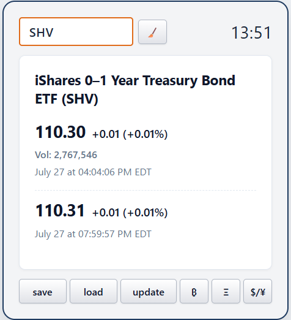

# Stroid

<div align="right">
  English | <a href="README.ja.md">日本語</a>
</div>

[](LICENSE)

Stroid is a web application for checking stock, foreign exchange, and cryptocurrency prices through a simple interface. Enter a ticker symbol to display the current price, change, volume, and market time using data from Yahoo Finance. For stocks, pre-market or after-hours prices are also shown when available.

The frontend is built with HTML, CSS, and JavaScript. The price API is implemented in Python using [`yfinance`](https://pypi.org/project/yfinance/). Bottle is used for local development, while the production setup uses AWS Lambda and S3.

## Features

- Search stock, foreign exchange, and cryptocurrency prices
- Display the current price, change, percentage change, volume, and market time
- Display pre-market and after-hours information for stocks
- Shortcuts for BTC/USD, ETH/USD, and USD/JPY
- Save and load a ticker symbol in the browser
- Compact interface for both desktop and mobile devices

<p align="center">
  
</p>

## Live Demo

[http://aws-s3-serverless.s3-website-ap-northeast-1.amazonaws.com/stroid/](http://aws-s3-serverless.s3-website-ap-northeast-1.amazonaws.com/stroid/)

## Project Structure

```text
.
├── public/                         # Static frontend
│   ├── index.html
│   └── static/
│       ├── script.js
│       ├── style.css
│       └── favicon.png
├── lambda/
│   └── lambda_function.py          # API for AWS Lambda
├── local_test.py                   # Local Bottle server
├── requirements.txt                # Python dependencies
├── run_Windows.bat                 # Windows startup script
└── .github/workflows/
    └── stroid-deploy-s3.yml         # Workflow that syncs public/ to S3
```

## Requirements

- Python 3 (uses `zoneinfo`)
- Internet connection

Yahoo Finance must be reachable to retrieve price data.

## Running Locally

```bash
pip install -r requirements.txt
python local_test.py
```

After the server starts, open <http://127.0.0.1:5400> in your browser.

The server listens on `0.0.0.0:5400`. To access it from another device on the same network, use the Network URL displayed at startup.

## Usage

1. Enter a Yahoo Finance ticker symbol in the input field.
2. Press `update` or the Enter key.
3. If needed, press `save` to store the ticker in browser LocalStorage and `load` to restore it.

Examples:

| Asset | Ticker |
| --- | --- |
| Apple | `AAPL` |
| Toyota Motor | `7203.T` |
| Bitcoin / USD | `BTC-USD` |
| Ethereum / USD | `ETH-USD` |
| USD / JPY | `JPY=X` |

The `BTC`, `ETH`, and `$/¥` buttons place the corresponding ticker in the input field. Press `update` afterward to retrieve the price.

## API

The local server provides the following GET endpoints.

```http
GET /api/quote?t=AAPL
GET /quote?t=AAPL
```

Example:

```bash
curl "http://127.0.0.1:5400/api/quote?t=AAPL"
```

Example response:

```json
{
  "ticker": "AAPL",
  "title": "Apple Inc. (AAPL)",
  "price": "210.50",
  "priceChange": "+1.25",
  "priceChangePercent": "(+0.60%)",
  "marketTime": "July 28 at 04:00:00 PM EDT",
  "volume": "Vol: 45,000,000",
  "postPrice": "210.80",
  "postPriceChange": "+0.30",
  "postPriceChangePercent": "(+0.14%)",
  "postMarketTime": "July 28 at 07:59:00 PM EDT"
}
```

Values are formatted as strings for display. If after-hours data or volume is unavailable, the corresponding fields are `null`.

| Status | Condition |
| --- | --- |
| `200` | The price was retrieved successfully |
| `400` | The `t` query parameter is missing |
| `500` | The ticker was not found or the external data request failed |

## Deploying to AWS

In production, `public/` is served as an S3 static website, and `lambda/lambda_function.py` is called through a Lambda Function URL.

### Lambda

- Handler: `lambda_function.lambda_handler`
- Runtime: Python 3.13
- Dependency: `yfinance`
- Input: the `t` query parameter of the Function URL

When deploying to Lambda, include `lambda_function.py` and its dependencies in the deployment package, or add the dependencies as a Lambda Layer. CORS must also be configured so the Function URL can accept browser requests.

The frontend endpoint is selected by `getApiUrl()` in `public/static/script.js`. If the S3 hostname or Lambda Function URL changes, update this function as well.

## AWS Deployment

`.github/workflows/stroid-deploy-s3.yml` syncs the contents of `public/` to the S3 bucket on every push to the `main` branch.

Required GitHub Secrets:

```text
AWS_ACCESS_KEY_ID
AWS_SECRET_ACCESS_KEY
```

The current workflow runs:

```bash
aws s3 sync ./public/ s3://aws-s3-serverless/stroid/ --delete
```

Note: This workflow deploys only the static files. `lambda/lambda_function.py` must be deployed to Lambda separately.

## Development Notes

- `local_test.py` and `lambda/lambda_function.py` contain the same price retrieval logic. Update both when changing retrieved fields or formatting.
- Displayed prices and times depend on data available from Yahoo Finance; real-time accuracy and completeness are not guaranteed.
- After-hours trading is not checked for cryptocurrencies or foreign exchange.

## License

[MIT License](LICENSE)
